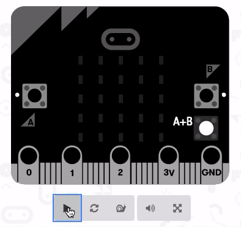

# micro-snake

It's snake, and it runs on [BBC Microbit](http://microbit.org/guide/).

## How do I run it?

1.  Copy the contents of `snake.ts`
2.  Go to the online [Microbit Simulator](https://makecode.microbit.org/)
3.  At the top, select `{} Javascript`
4.  Paste the snake code into the editor

Alternatively, you can [install the program on your Microbit](https://makecode.microbit.org/device/usb).

# How do I play it?

*   Press `A+B` to start.
*   Press `A` to turn anti-clockwise
*   Press `B` to turn clockwise

